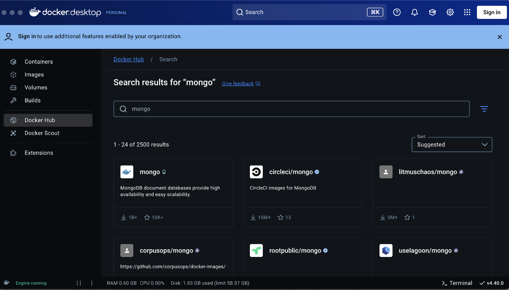
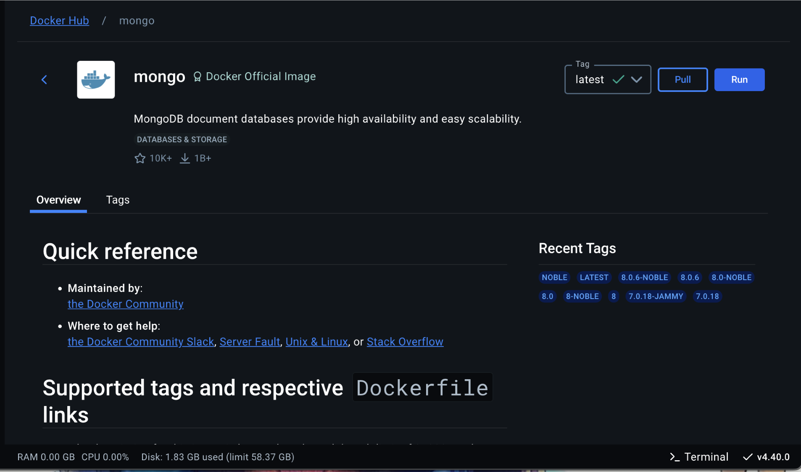
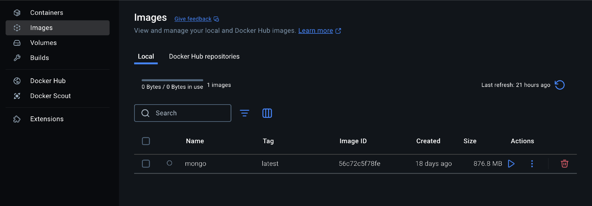
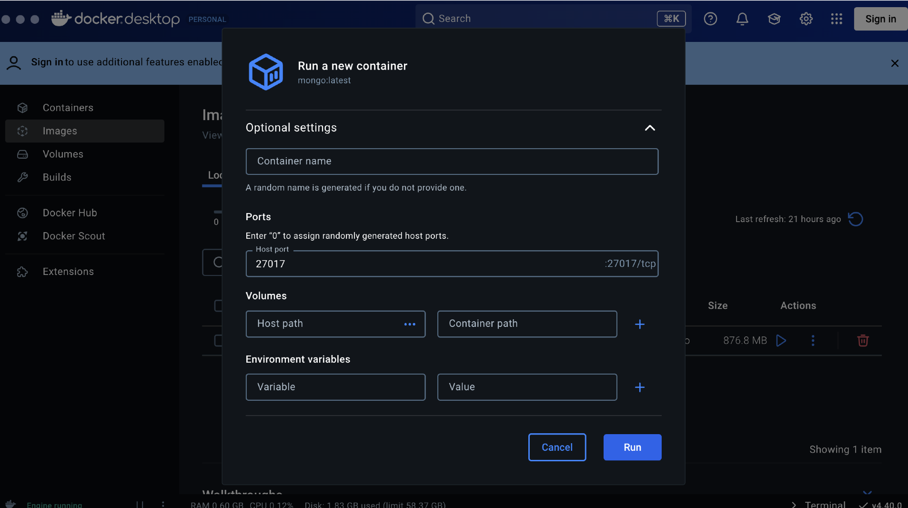

# In-Class-Example-NoSQL-Mongo

This example shows how to run a Docker Image with a MongoDB server

First, download Docker Desktop at the following link: https://docs.docker.com/get-started/get-docker/

Once downloaded, open Docker Desktop and click on the tab labeled "Docker Hub" and search for "Mongo"



Click on the Mongo image, then click on the Pull button near the top-right corner.



Once downloaded, traverse to the images tab and press the Run Triangle for the Mongo Image. There will be a screen for optional arguments. Expand this menu.



In the Optional Arguments, set the "Host Port" to '27017'. This is to allow us to access the image in the program.



Press the run button now. This will make something called a Container. We can run this same container later if we want to access the same data. To do so, go to Containers and run the one you just made.

Once Docker is setup, open a terminal and traverse to the `./MongoExample` folder. Once in the `./MongoExample` folder, you can run the command
```bash
dotnet run
```

If you wish to play around with the MongoDb queries, the follow resources should help!

- How to Write Queries: https://www.mongodb.com/docs/drivers/csharp/current/fundamentals/specify-query/
- Finding First Match: https://www.mongodb.com/docs/drivers/csharp/current/usage-examples/findOne/
- Finding All Matches: https://www.mongodb.com/docs/drivers/csharp/current/usage-examples/findMany/
- Inserting Documents into a Collection: https://www.mongodb.com/docs/drivers/csharp/current/usage-examples/insertMany/
- Aggregate Functions: https://www.mongodb.com/docs/drivers/csharp/current/fundamentals/aggregation/